# README

[TOC]


## :couple: 팀원 정보 및 업무 분담 내역

### :smiley: 팀장 : 김미애

> front-end 담당

```
- 프로젝트 방향 구상 및 스토리보드 작성
- vuex store module 설계
- front-end (UI, UX) 디자인
- MovieScore Model 설계 보조
```


### :slightly_smiling_face: 팀원 : 유현욱

> back-end 담당

```
- 프로젝트 방향 구상 및 ERD 작성
- DRF 서버 및 Django-Model 설계
- UI, UX 및 css 보조 
```


## :goal_net: 목표 서비스 구현 및 실제 구현 정도

> ★-완료 ☆-미완료

#### :soccer: 게시판 기능

- 글, 댓글 작성, 수정, 삭제 ★
- 글 좋아요, 좋아요 취소 ★
- 글 당 댓글, 좋아요 갯수 표시 ★

#### :soccer: 영화

- 영화 좋아요, 좋아요 취소 ★
- 평점, 영화 댓글 기능 ★
- 인기 영화 메인페이지에 보여주기 ★

#### :soccer: 유저

- 좋아요 한 글, 영화 링크 ★
- 좋아요 한 영화 기반 추천 영화 제공 ☆

#### :soccer: 스타일

- 배경 이미지 넣기 ★
- 폰트 적용 ★

​	

## :envelope_with_arrow: 데이터베이스 모델링(ERD)

> draw.io 페이지에서 설계

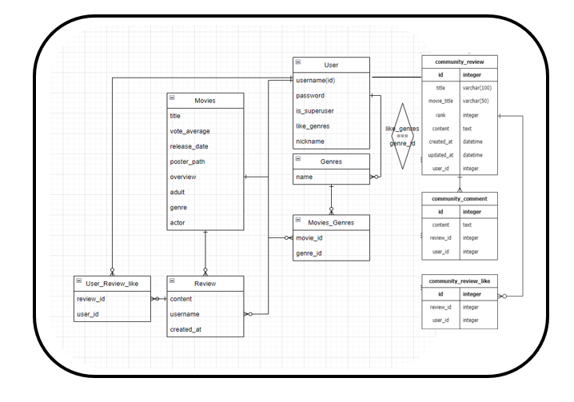

#### :pen: User 모델

- 관리자 권한의 유저로 영화 CRUD 구현
- 로그인한 User 게시글 CRUD 구현
- 회원가입 구현

#### :pen: Article 모델

- 영화 정보와 관련된 소통할 수 있는 커뮤니티 구현
- 게시글 좋아요 구현
- 댓글 CRUD 구현

#### :pen: Movie 모델

- 인기영화 랜덤식으로 영화리스트 구현
- 영화 평점 및 리뷰 게시글 CRUD 구현
- 영화 좋아요 구현
- adult 에서 성인용 필터링 구현
- genre를 이용하여 좋아요 클릭한 영화와 같은 장르를 추천 페이지로 구현
- actor를 이용하여 배우 정보 구현


## :page_with_curl: 필수 기능에 대한 설명


### :pencil2: A. 관리자 뷰

> 관리자 권한의 유저만 영화 등록 수정 삭제 권한을 가진다.
>
> 관리자가 아니라면 확인을 누르면 다시 Home으로 페이지가 돌아간다.

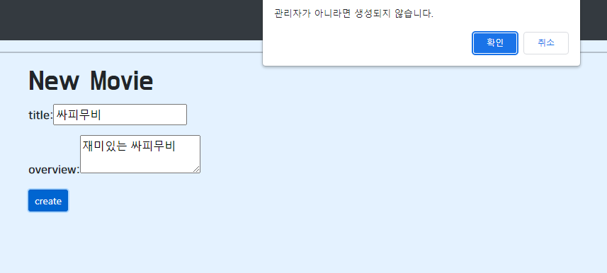

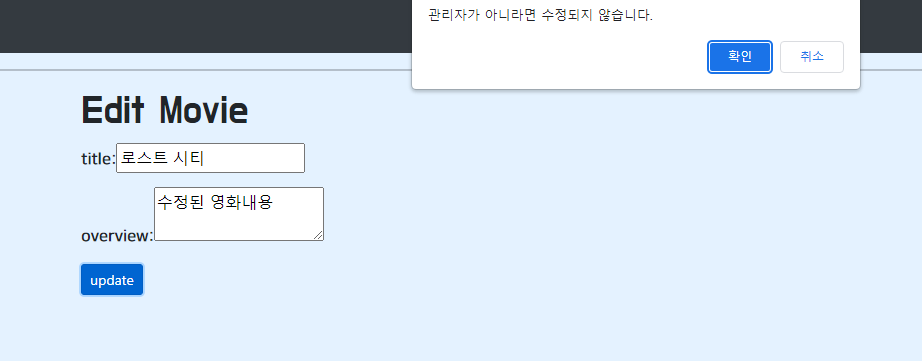

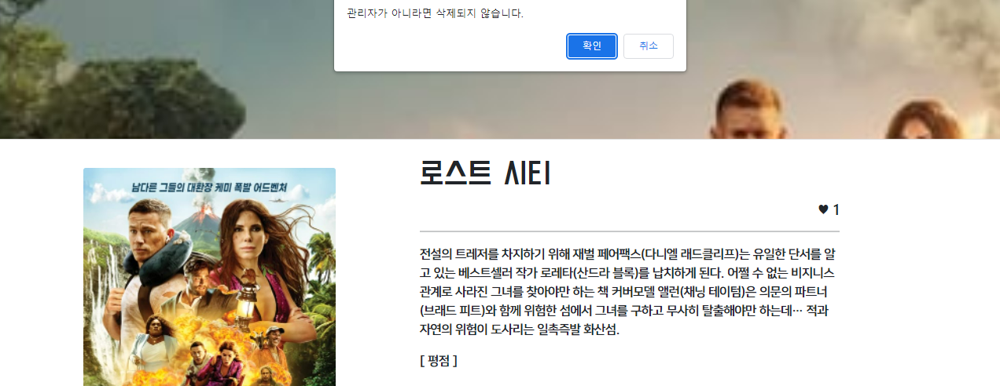


### :pencil2:B. 영화정보

>  영화 데이터는 Database Seeding을 활용하여 약 10,000개 이상의 데이터가 존재하도록 구성했다.
>
> 로그인 된 유저는 영화에 대한 평점 등록 / 수정 / 삭제 등을 할 수 있다.


#### :gem: Login - Signup - Logout 페이지

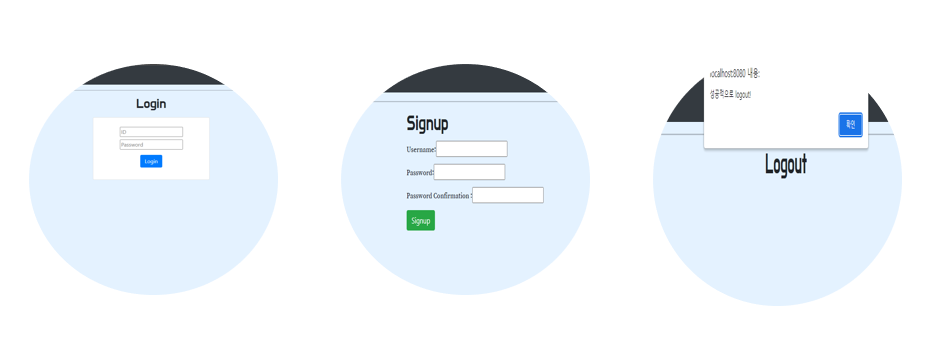

#### :gem:Homepage

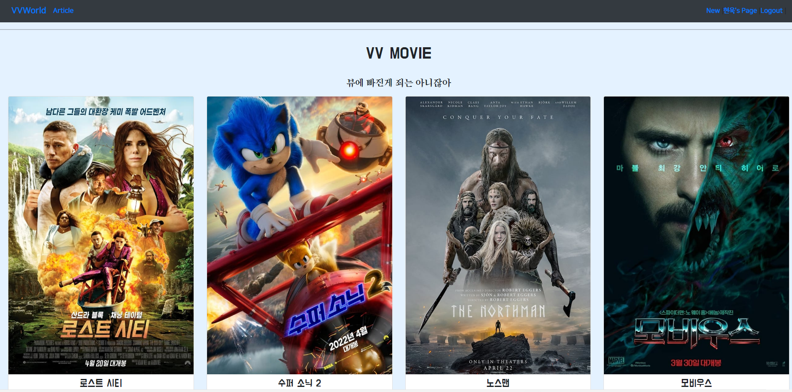

- 로그인을 한  유저는 Home으로 들어온다.
- 인기영화를 랜덤으로 추천해주는 데이터를 받아와 영화리스트를 구현했다.
- 각각의 영화 포스터를 클릭하면 상세정보 페이지로 들어간다.


#### :gem:MovieDetail

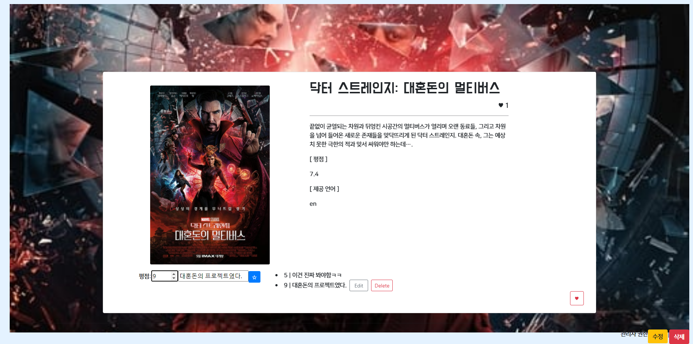

- 영화의 상세정보를 보여준다 : 제목, 포스터, 내용, 평점, 제공언어

- 평점 구현 : 로그인 된 유저는 영화에 대한 평점 CRUD를 할 수 있다.

- 좋아요 구현 : 로그인 된 유저는 좋아요를 누를 수 있다 (아래 빨간하트를 누르면 됨)

  - 좋아요를 누를 영화는 profile 페이지에서 볼 수 있다.

  

### :pencil2:C.  영화 추천 알고리즘

> 인기 영화를 추천받는 알고리즘을 통해 추천 영화 리스트 구현


#### :gem:Recommend

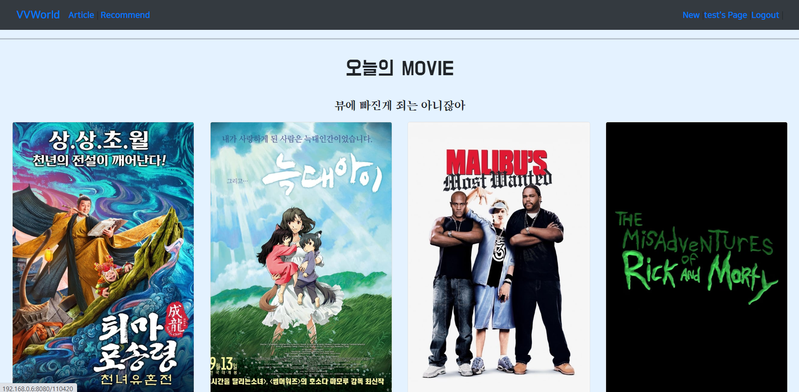

- 인기영화를 랜덤으로 추천받아 추천영화리스트를 구현했다.
- 영화 포스터를 클릭하면 상세정보페이지로 넘어간다.


### :pencil2:D. 커뮤니티

> 영화 정보와 관련된 소통을 할 수 있는 커뮤니티 기능을 구현
>
> 로그인된 사용자만 게시글을 생성, 조회가 가능하며 작성자만 수정 삭제가 가능하다.
>
> 댓글 작성 시 작성자만 댓글을 수정 및 삭제할 수 있다.


#### :gem:New Article - Create Article

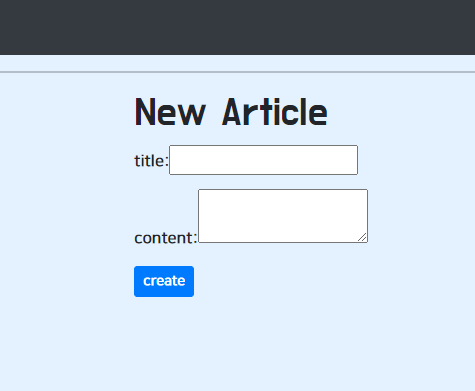

- 사용자만 게시글을 작성할 수 있다.

- create 를 누르면 게시글의 상세창으로 넘어간다.


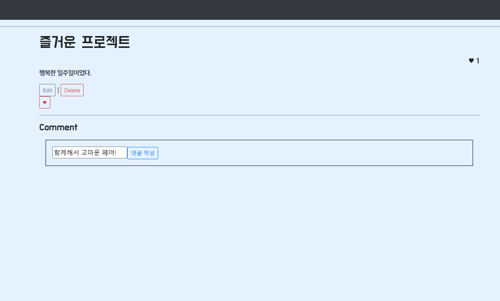

- 게시글 상세정보를 알 수 있다.
- 작성자만이 수정 삭제가 가능하다.
- 작성자 및 다른 유저들은 좋아요를 누를 수 있다.
- 작성자 및 다른 유저들은 댓글을 작성할 수 있다.


#### :gem:ArticleList

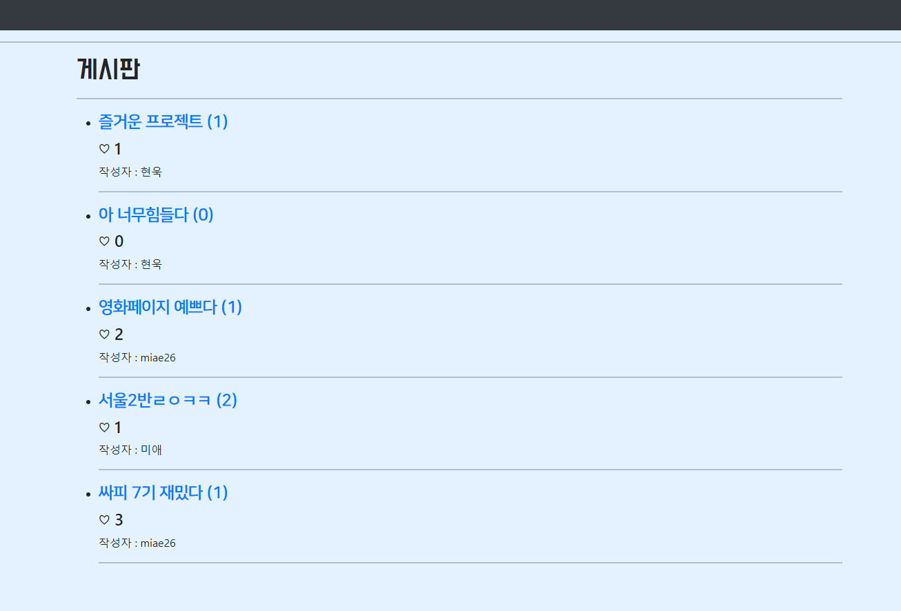

- 게시글 목록을 볼 수 있다.
- 게시글 제목을 누르면 게시글 상세정보창으로 넘어간다.


### :pencil2:E. 기타

#### :gem:MyPage

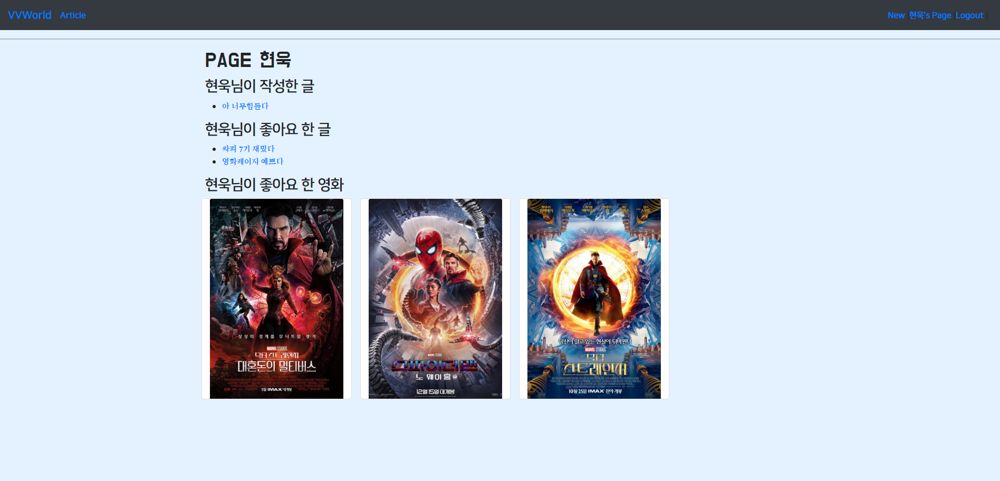

- 게시판에서 작성한 글의 목록을 볼 수 있다. 게시글을 누르면 상세정보창으로 넘어간다.
- 게시판에서 좋아요 한 글의 목록을 볼 수 있다.게시글을 누르면 상세정보창으로 넘어간다.
- 좋아요를 누른 영화의 목록을 볼 수 있다. 영화 포스터를 누르면 영화의 상세정보창으로 넘어간다.


## :heart_decoration: 느낀점

### :smiley: 김미애

- 지난 5개월동안 배운 다양한 프로그래밍 언어를 배우면서 각 언어의 필요성과 유용성에 대해 알았다면, 학습했던 프레임워크인 DRF, Vue 을 이용하여 직접 언어를 활용하면서 하나의 페이지를 구현하는 과정하였다. 어린이가 해외에 살면서 타국의 언어를 익히듯이 서투르지만 천천히 말을 하는 방법을 배운 것만 같았다. 또한 깃 협업을 통하여 아주아주 많은 고난과 역경이 있었지만 팀원과 함께 계속 오류와 충돌을 해쳐나가면서 깃 협업을 잘 해나갈 수 있을 것이라고 자부한다.
- 백지의 종이에 스토리보드를 그려보고, 필요한 데이터와 정보를 ERD로 짜내가면서 웹 프로젝트의 뼈대를 작성하는 것이 중요하다고 생각했기에, 생각보다 많은 시간을 투자했었다. 하지만 결과적으로 기능 구현에 있어서 시간이 부족했던 것으로 보아, 프로젝트 구현일에 있어서 좀 더 체계적으로 시간 분배를 해서 계획을 세워야겠다는 생각이 들었다. 

- 프론트엔드에 대한 흥미가 생겼다. 웹페이지에서 내가 칠한 색이 나오고, 폰트가 바뀌고, 각 기능에 필요한 데이터들이 보이고 그 페이지를 꾸며나가는 것이 두 눈으로 바로바로 보이는 것이 재미있었다. 내가 디자인적인 면모가 있었다면 보다 디테일한 부분까지 예쁘게 만들었을 것지만, 부트스트랩 및 여러가지 UX, UI에 대한 내용에 대해 공식문서 등 다양하게 찾아보면서 피곤하지만 계속 프로젝트를 만들어갈 수 있어 뿌듯했다.

### :slightly_smiling_face: 유현욱

- 최종 프로젝트를 진행하면서 마지막까지 포기하지 않고 하나뿐인 조원을 다독여가며 끝까지 완주한 팀장님한테 감사하다는 생각이 든다. 이번 프로젝트는 영화추천 사이트를 만드는 것인데, 지난 1학기 동안 배웠던 내용에 대한 이해도 필요하고, 이때까지 잘 안했던 추가 기능에 대한 구현들이 많이 필요했기 때문에 상당히 어렵다고 생각했다. 그리고 추가 기능에 대해 생각을 하고 그것을 코드로 구현해내는데 예상한 시간보다 더 많은 시간이 걸리기 때문에 남은 시간을 잘 활용하는 능력이 필요하다는 것을 느꼈다. 이번 프로젝트의 추천 알고리즘 기능을 작성하는데 있어 하루정도만 더 있었다면 구현할 수 있었을 것 같다는 아쉬움이 남았기 때문이다.
- 마지막으로 팀프로젝트를 통해 무언가를 만들어본 경험이 매우 값지다는 생각이 들었다. 프로젝트를 시작할때만 해도 접근조차 힘들고, 아무것도 구현하지 못할 것같은 막연한 두려움이 있었는데, 비록 완벽히 다 구현하지는 못했지만 나름의 성과물을 보면서 지난 노력에 대한 보상을 받은 기분이라 좋게 마무리 할 수 있었던 것 같다.

